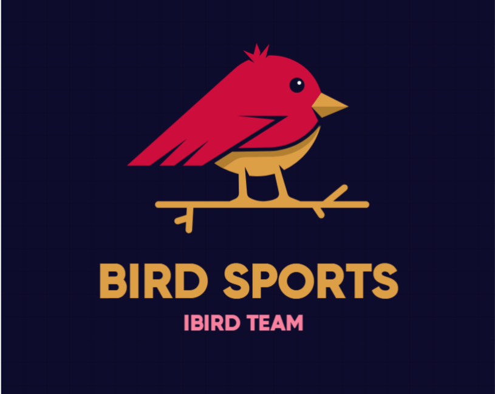

# COMPSCI-715-Group-3-Project-12-iBird

<p align="center">
    
</p>

**Welcome to iBird – an app where purposeful edugaming concept bird-watching meets exergaming! Our research aims to explore the question, "Is the combination of edugaming and exergaming concepts more effective than using exergaming concepts alone with regard to increasing physical activity, motivation, and enjoyment and reducing pressure/tension.", no study has combined these concepts in one app yet.**

**We conducted a user study with 20 participants, and our results show that the bird-watching edugaming concept can boost the level of physical activity, enjoyment, and perceived usefulness and can reduce people's pressure. It is very motivating for players! So join us on iBird!**

## Deployment
If you simply want to run our app without installing the necessary requirements on your machine to run it locally, visit the link below. We have deployed our application to a cloud service:

`Standard Version`: [https://ibird-user-study-version-7ff1aac89dc2.herokuapp.com/login](https://ibird-user-study-version-7ff1aac89dc2.herokuapp.com/login)

`User Study Version (with higher rewards)`: [https://ibird-production-version-52efc5e739d2.herokuapp.com/login](https://ibird-production-version-52efc5e739d2.herokuapp.com/login)

## Project Structure
`examples` folder: This folder contains examples that serve as the building blocks for our project. For more details, please refer to the readme file within this folder. Running an example is straightforward; simply open the .html file in your browser. However, some examples require an API key, so check the readme files in the folder for further information. <span style="font-weight: bold;">You don't necessarily need to run these examples</span>, as we've already incorporated them into our project. This folder contains some initial examples we created to explore how to utilize the APIs.

`backend` folder: This folder contains the source code for our backend server, which serves players' requests.

`frontend` folder: This folder contains the source code for our frontend, which offers a responsive and user-friendly UI that interacts with the backend server.

## Branches Explanation
#### main
This branch contains the final version of the standard version of our application.

#### userStudy
This branch contains the final version intended for the user study. We used this version when conducting the user study. The only difference between this branch and the main branch is that some constants are set differently to increase the rewards, ensuring participants have a comprehensive experience with all the application's functionalities.

#### All Other Branches
These are intermediary versions. Some are used for intermediate UI improvements or modifications, some for comments and documentation, and others for adding quiz and birds data. You don't need to worry about these branches.

## Requirements
Before running the application, ensure you have installed the latest LTS version of Node.js and NPM on your PC ([Download Link](https://nodejs.org/en)). 

If an error occurs while executing our application, which is highly unlikely, consider using [Node.js version 18.14.2 and NPM version 9.5.0](https://nodejs.org/en/blog/release/v18.14.2).

## Running the Project
### Preparation
1. Clone the project repository from GitHub
```bash
git clone https://github.com/D-Z-2020/COMPSCI-715-Group-3-Project-12-iBird.git
```

2. If you want to run the standard version, switch to the `main` branch.
```bash
git checkout main
```

3. If you want to run the user study version, switch to the `userStudy` branch.
```bash
git checkout userStudy
```

### Backend
1. Change directory to the backend folder
```bash
cd backend
```
2. Install required libraries
```bash
npm install
```
3. Run the backend
```bash
npm run dev
```
4. You should see the backend running at [http://localhost:3001](http://localhost:3001)

### Frontend
1. Change directory to the frontend folder
```bash
cd frontend
```
2. Install required libraries
```bash
npm install
```
3. Run the frontend
```bash
npm run dev
```
4. You should see the frontend running at [http://localhost:5173](http://localhost:5173)
5. Using a modern browser like Chrome, visit [http://localhost:5173](http://localhost:5173) and enjoy!

Please run the backend first, followed by the frontend.